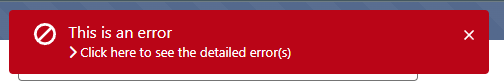
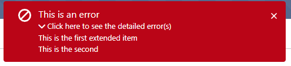

# lwc-globalCustomToast

This project was based on this work : https://cafeforce.com/custom-toast-notification-lwc-salesforce/

The original idea of the creator was to be able to use Toast Notification everywhere.

## This project extends this idea on three sides : 

- Be able to setup the toast component at the root of your LWC and to be able to call it from everywhere, no matter how many level deep.
- Be able to mimic the expandable Salesforce error toast.
- Be able to manage the appearance and disappearance of the Toast

## This project contains :

- The component globalCustomToast
- A test component customShowToastExample that can be placed in a record page or in another component to understands the different requirements and possibilities
- The messageChannel designed to be the bridge between the sending component and the receiving component.
- The fontAwesome library

## Setup

- Copy the lwc, messageChannels and staticresources folders and paste them into your project.
- Call the globalCustomToast component in your parent component
- In every child component where you want to call the custom toast, import and initialize the MessageContext variable.
- Feel free to use the demo component as an example

## Features

- Set toast disappearance time: If the user hovers the mouse over the toast, the toast becomes static and a manual close option appears. It is also possible to keep the component visible until closed.
- Adaptive display: If the call contains details, the toast will appear with an accordion section containing the details.

## Examples : 

**Error containing details closed:**

**Error containing details opened:**

**Warning without details without timer:**

**Success with timer not hovered yet:**

